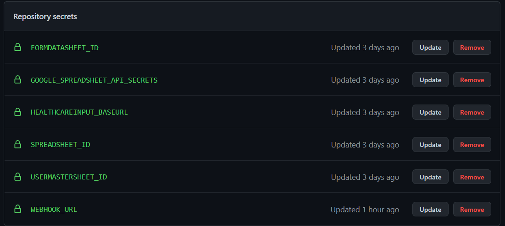
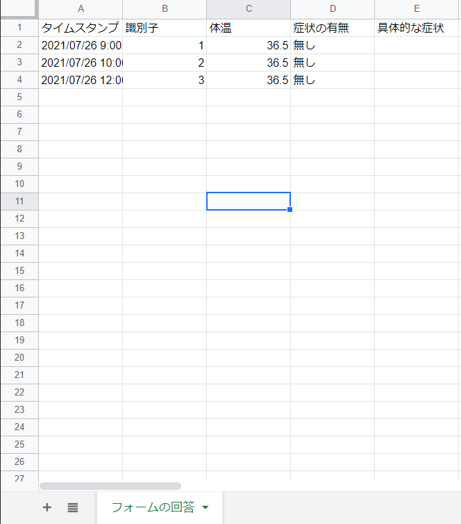
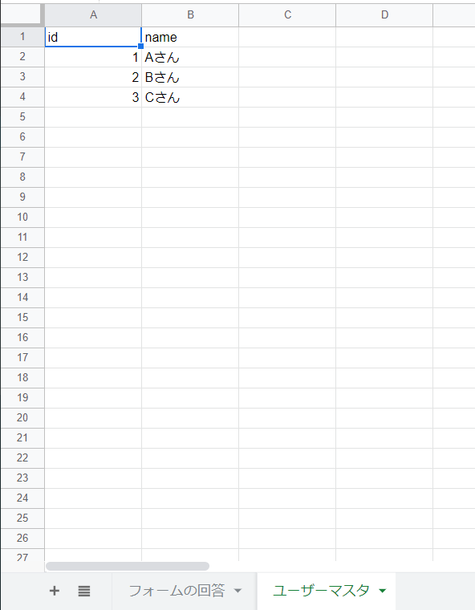

# 健康管理入力リマインダー
[健康監視ツール](https://www.health-monitoring.net/)で作成したフォームから1日1回データを取得し、未入力者の名前と入力フォームURLをリストアップしてIncomming Webhook宛に送信します。  
デフォルトで月~金16時に未入力者のチェックとメッセージの送信を行います。  
(GitHub Actionsのスケジュール実行は時間通りに動作しないため注意。[参考](https://docs.github.com/ja/actions/reference/events-that-trigger-workflows#scheduled-events))

# 利用方法
スケジュール実行は`GitHub Actions`、  
Incomming Webhookは`Microsoft Teams`の利用を想定しています。

以下SecretsをGitHubへ登録してください。




# Secretsの説明
## GOOGLE_SPREADSHEET_API_SECRETS
健康監視ツールで生成したフォームから登録されたデータを読み込むためにGoogleSheetsのAPIを利用します。  
認証情報jsonファイルのbase64エンコード文字列を登録してください。  
例: 認証情報のjsonファイルを`credentials.json`として扱います。  
``` shell
$ cat ./credentials.json | base64
```
上記のコマンドを実行し出力されたbase64文字列を登録してください。

## SPREADSHEET_ID
フォーム回答スプレッドシートURLに表示されているIDを登録してください。  
以下の例の場合`XXXXX`の部分が該当します。  
例:`https://docs.google.com/spreadsheets/d/XXXXX/edit#gid=0`

## FORMDATASHEET_ID
フォーム回答データが記載されているシートを開いた際のgidを登録してください。  
以下の例の場合`12345`の部分が該当します。  
例:`https://docs.google.com/spreadsheets/d/XXXXX/edit#gid=12345`

  


## USERMASTERSHEET_ID
ユーザー識別子と名前の情報が記載されているシートのgidを登録してください。  
以下の例の場合`6789`の部分が該当します。  
例:`https://docs.google.com/spreadsheets/d/XXXXX/edit#gid=6789`

  

## HEALTHCAREINPUT_BASEURL
回答フォームのURLを登録してください。  
回答者の識別子をURLに自動で含めるため、URLの末尾が`=`で終わるように`=`以降の文字列は取り除いてください。

## WEBHOOK_URL
当日の未回答者をリストアップしたメッセージを投稿する`Webhook URL`を登録してください。

# LICENSE
MIT License